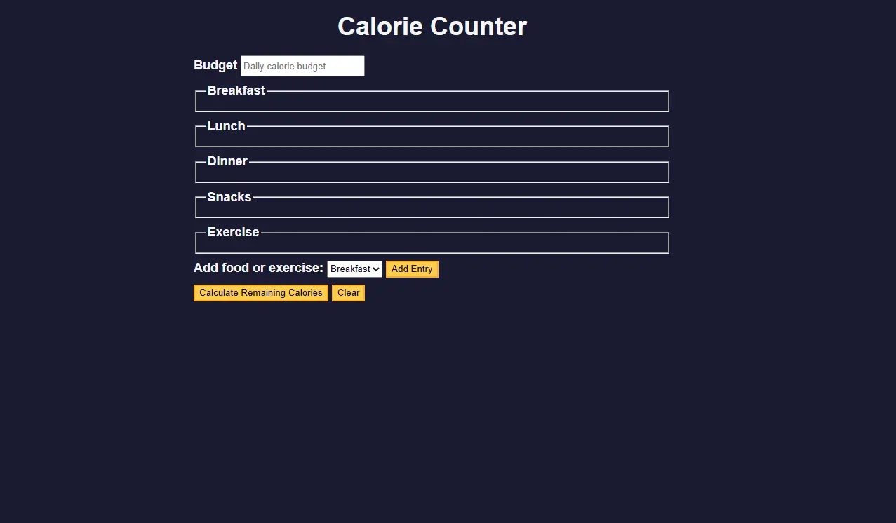

# 🥗 Calorie Counter

his is a simple calorie counter web application built as part of the [freeCodeCamp JavaScript Algorithms and Data Structures Certification (v8)](https://www.freecodecamp.org/learn/javascript-algorithms-and-data-structures-v8/) course.

The project focuses on **form validation** using vanilla JavaScript, demonstrating how to handle user input, perform real-time validation, and display feedback.

## 📸 Preview

## 🚀 Features

- Responsive form layout
- Real-time input validation
- Error messages for:
  - Empty fields
  - Invalid date format
  - Non-numeric or negative calorie values
- Accessible and user-friendly design
- Calories are tracked by meal and date

## 📚 What I Learned

- Event handling and form submission
- Creating and using custom validation logic
- Using regular expressions for input checks
- Improving user experience with helpful validation messages

## 💻 Technologies Used

- HTML5
- CSS3
- JavaScript (ES6+)

## 💡 How to Use

1. Fill in the food name, calorie count, and date.
2. Click **Add Meal** to submit.
3. If any field is invalid, an error message will be displayed.
4. Valid meals will be added to the meal list.

## 🧠 Author

Developed by [Gustavo Ávila](https://github.com/gusavila) during the freeCodeCamp curriculum.
